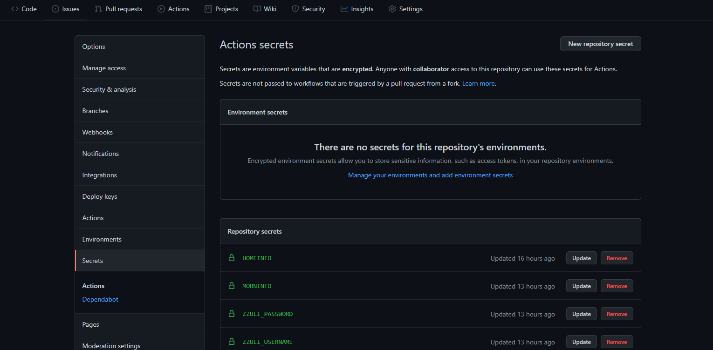
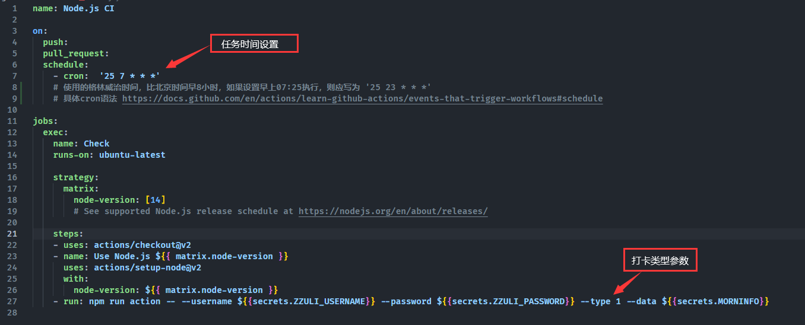
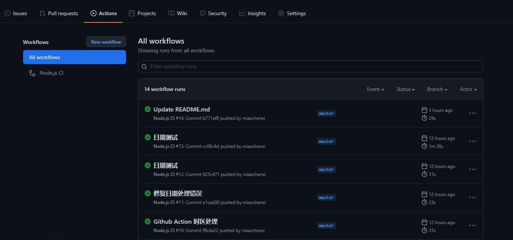
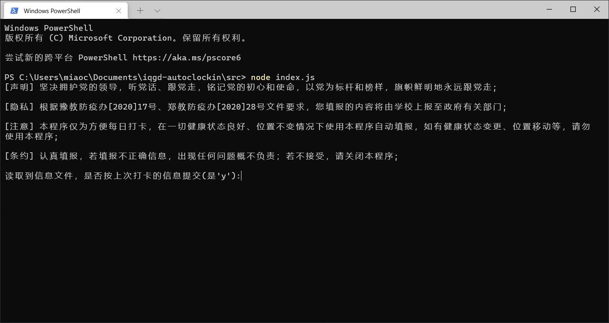
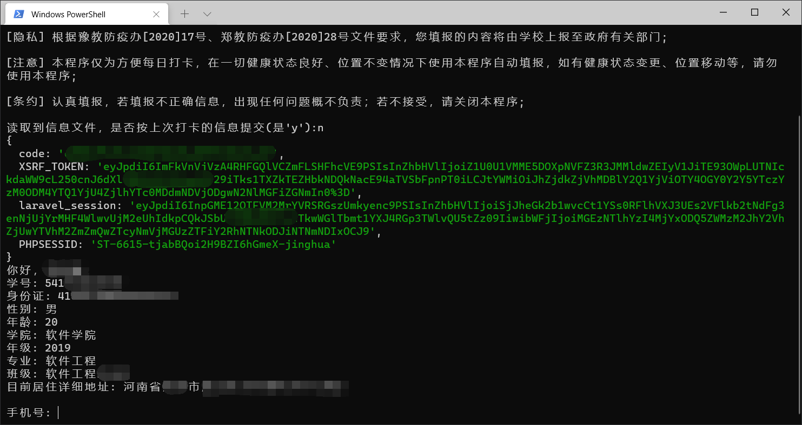
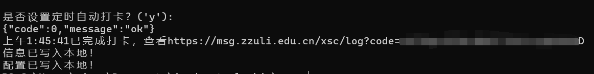

<h1 align="center">🎉 i 轻工大健康填报自动化 🎉</h1>
<p align="center">
  =v8.5.4-brightgreen.svg" />
  
</p>

基于 Nodejs ，实现自动考勤打卡，无需每日定闹钟提醒自己，无需担心被拉入黑群，也无需担心忘记打卡被点名批评。

**功能**： 支持在校晨检、居家打卡，可设置定时打卡任务，记录提交信息，若信息不变，无需再次录入；登录后无需再次输入凭证，默认记住密码。

**请确保在 i 轻工大上至少填报过一次**。


## 环境 💻

运行环境 Nodejs > v8.5.4，[Nodejs下载](https://nodejs.org/en/)

安卓、Windows、Linux ... 只要可以运行 Nodejs

## 部署 🛠

### 方式一

简单，但需要开着电脑，程序挂在后台,保证网络畅通。

将仓库克隆到本地

```bash
git clone https://github.com/miaochenxi/iqgd-autoclockin.git
```

进入项目文件夹

```bash
cd iqgd-autoclockin
```

运行

```bash
npm run start
```

或者

```bash
cd src
node index.js
```

### 方式二

方便，利用 GitHub Actions 执行 Nodejs CI 定时任务，但需要细心和一定动手能力。

1. fork 本仓库  
建议在 fork 后，将自己的仓库设置为私有，以免个人信息公开可见。若不想设置私有，可在每次上传代码之前，清空json文件夹下所有文件的内容，均写为 `{}`。

2. 将你的仓库克隆到你的电脑

```bash
git clone 你的仓库地址
```

3. 在电脑上先进行一次填报，目的是将你的信息记录，并在下一步进行编码。如何运行，参考方式一。

4. 填报完成后，运行 `npm run encrypt` ，复制你需要的内容，根据上一步填报的内容，将输出晨检或是居家信息的Base64编码

5. 在浏览器中进入你的仓库 Settings-->Secrets，右上方 `New repository secret` ，依次点击添加：`ZZULI_USERNAME` 值为智慧门户用户名， `ZZULI_PASSWORD` 值为门户密码， `MORNINFO` 值为上一步复制的晨检信息编码， `HOMEINFO` 值为上一步复制的居家信息编码。（MORNINFO 和 HOMEINFO 打哪种卡添加哪个，用不到的可以暂时不添加，请不要复制多余空格）


6. 使用 VSCode 或其他编辑器，配置项目的 .github/workflows文件夹下的 `node.js.yml` 文件，注意缩进，不正确的缩进将出现语法错误。


- 使用的格林威治时间，比北京时间早8小时，如果设置早上07:25执行，则应写为 '25 23 * * *' ，图片测试时截的，懒得更新了
- 具体cron语法 https://docs.github.com/en/actions/learn-github-actions/events-that-trigger-workflows#schedule
- 在校晨检设置 type 参数为 1 ，居家填报设置 type 参数为 0
- 自己使用时，请将 on 后的 `push:` 与 `pull request:` 删除，这是测试CI时用的，否则你也将在提交或 merge pull request 时执行任务

7. 完成以上步骤后，commit 并 push ，任务将在指定时间执行，可在你仓库的 Actions 中查看运行结果


## 运行 ⚙

`y` 一般对应确认，`n` 对应否定，什么都不输入按回车认定为与括号提示中相反的语义





## 重要 ❗

[声明] 坚决拥护党的领导，听党话、跟党走，铭记党的初心和使命，以党为标杆和榜样，旗帜鲜明地永远跟党走;

[隐私] 根据豫教防疫办[2020]17号、郑教防疫办[2020]28号文件要求，您填报的内容将由学校上报至政府有关部门;

[注意] 本程序仅为方便每日打卡，在一切健康状态良好、位置不变情况下使用本程序自动填报，如有健康状态变更、位置移动等，请勿使用本程序;

[条约] 认真填报，若填报不正确信息，出现任何问题概不负责；若不接受，请不要使用;
